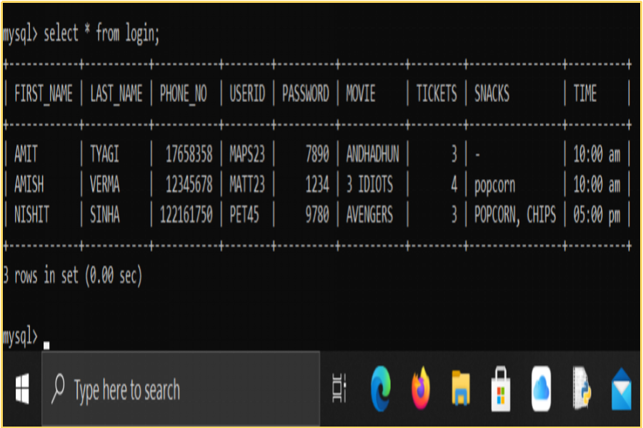

<h1> MySQL interface with Python </h1> 

<h2> OUTPUTS </h2>
<ul>
  <li>
    Table with existing customers
  </li>
  
<!--    -->

<li>
  Upon Sign Up
</li>

<!--    -->

<li>
  Output Screens (Python IDE)
</li>
  
  
  
  
  
<!--   
  
  
  
   -->

<li>
  SQL
</li>
 
<!--  -->

</ul>
